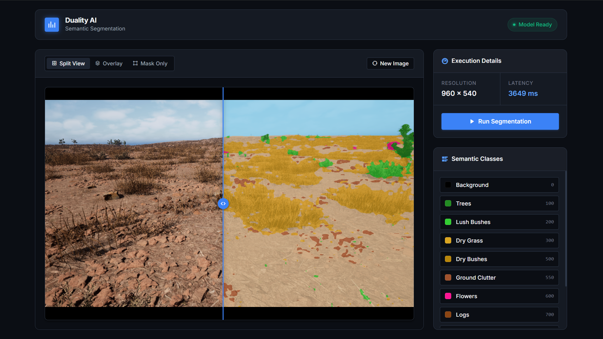

# Offroad Autonomy Semantic Segmentation



Hackathon submission for the Duality AI Offroad Autonomy Segmentation Challenge.

This project builds a semantic segmentation pipeline for off-road autonomous driving scenes using synthetic data from Duality AI. The model predicts a class label for every pixel in an image, helping identify terrain and environmental elements such as trees, bushes, rocks, landscape, sky, logs, and flowers.

## Overview

- Challenge: segment off-road scenes for autonomy perception
- Team: Team Chaos
- Framework: PyTorch
- Model: DeepLabV3+ with MiT-B2 backbone
- Classes: 11 semantic classes
- Training environment: Kaggle Notebook GPU
- Deliverables: training code, inference script, exported weights, and a Flask demo UI

## Problem Statement

Off-road autonomy requires a detailed understanding of terrain and obstacles at the pixel level. Unlike standard road-scene segmentation, this setting includes unstructured environments with vegetation, rocks, clutter, and uneven ground. Our goal was to train a robust model that generalizes well to unseen off-road scenes while remaining efficient enough for practical inference.

## Approach

We used `segmentation_models_pytorch` to build a DeepLabV3+ network with a MiT-B2 encoder. This combination gave us strong multi-scale context capture with a relatively lightweight backbone.

To improve generalization, we applied aggressive augmentations with `albumentations`, including flips, rotations, grid distortion, elastic transforms, color jitter, grayscale conversion, and blur. To address class imbalance, we combined weighted cross-entropy with Dice loss so that rare classes such as logs, flowers, and dry grass were not ignored during training.

## Training Environment

Model training was performed in a **Kaggle Notebook** using GPU acceleration. This repository contains the training code used for the experiment, along with the local scripts for inference and the Flask-based demo UI. The trained checkpoint, `best_model.pth`, was exported from the Kaggle training run for local testing and visualization.

## Results

- Kaggle Notebook: [https://www.kaggle.com/code/mdjuned45/offroad-semantic-segmentation-deeplabv3-mit-b2](https://www.kaggle.com/code/mdjuned45/offroad-semantic-segmentation-deeplabv3-mit-b2)
- Best validation mIoU: `0.5283`
- Inference speed: typically under `50 ms` per image in the target setup
- Output: colorized segmentation masks for visual inspection and a browser-based interactive demo

## Semantic Classes

The model predicts the following classes:

`Background`, `Trees`, `Lush Bushes`, `Dry Grass`, `Dry Bushes`, `Ground Clutter`, `Flowers`, `Logs`, `Rocks`, `Landscape`, `Sky`

## Repository Structure

- `train.py` - training pipeline used for the Kaggle experiment
- `test.py` - batch inference on unseen images
- `app.py` - Flask app for interactive testing
- `requirements.txt` - Python dependencies
- `Hackathon_Report.md` - short technical write-up
- `details.pdf` - supporting report / submission material
- `best_model.pth` - not included due to file size. Download from the Kaggle notebook output: [link]

## Setup

Create a Python environment and install the dependencies:

```bash
pip install -r requirements.txt
```

## Dataset Layout

Expected dataset structure:

```text
data/
  train/
    Color_Images/
    Segmentation/
  val/
    Color_Images/
    Segmentation/
  testImages/
    Color_Images/
    Segmentation/
```

## Training Reference

The model was trained entirely on **Kaggle** due to the dataset size and GPU requirements. 
We have included `train.py` in this repository so you can see the exact code used for training (including augmentations, our custom weighted loss function, and optimization strategies). 

*Note: If you wish to reproduce the training locally, you will need a capable GPU and must download the full dataset into the `data/` folder before running `python train.py`.*

## How to Run Locally

The intended way to use this repository is to download our pre-trained model and run inference locally.

### 1. Download Pre-trained Weights
Since GitHub has strict file size limits, the `best_model.pth` file (248MB) is not included in this repository. 
- Download it from our Kaggle Notebook output: [https://www.kaggle.com/code/mdjuned45/offroad-semantic-segmentation-deeplabv3-mit-b2](https://www.kaggle.com/code/mdjuned45/offroad-semantic-segmentation-deeplabv3-mit-b2)
- Place `best_model.pth` directly in the root directory of this repository.

### 2. Batch Inference
To run the model on a folder of unseen test images:

```bash
python test.py
```

This will:
- Load the `best_model.pth` weights
- Run inference on the images located in `data/testImages/Color_Images`
- Save the predicted colorized masks to the `runs/test_outputs/` directory

### 3. Interactive Web Demo
To launch the Flask web application for interactive testing:

```bash
python app.py
```

Then open your browser and navigate to:
```text
http://127.0.0.1:5000
```

The UI supports:
- Image uploads
- Interactive split-view comparisons
- Overlay mask visualizations
- A class legend display for quick qualitative testing

## Key Design Choices

- DeepLabV3+ for strong dense prediction performance
- MiT-B2 encoder for a good accuracy-speed balance
- heavy augmentation to reduce overfitting to synthetic textures
- weighted loss to handle rare and thin classes
- cosine annealing warm restarts and AdamW optimization
- mixed precision training for faster GPU training in Kaggle

## Limitations

- performance can still drop on rare classes and hard shadows
- current training script is primarily tuned for GPU usage
- the included demo is intended for qualitative testing, not production deployment

## Future Improvements

- stronger domain adaptation from synthetic to real-world off-road scenes
- model ensembling for higher final IoU
- self-supervised pretraining for better feature extraction
- test-time augmentation and post-processing for cleaner masks